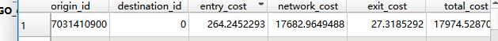

# od 矩阵的计算
od矩阵是众多origin以及destination之间的距离记录。
## 存储
od矩阵的存储有两种形式：
- origin 以及 destination构成的双主键，以及cost 列
- origin 以及destination 构成的 m n 矩阵
## 距离
距离有多种形式：

在地理学中，距离可以有多种形式，具体取决于所使用的测量方法和应用场景。以下是几种常见的距离形式：

1. **直线距离（欧几里得距离）**：
   - 这是两点之间的最短路径，通常在二维或三维空间中计算。公式为：
     $$
     d = \sqrt{(x_2 - x_1)^2 + (y_2 - y_1)^2}
     $$
     在三维空间中，公式为：
     $$
     d = \sqrt{(x_2 - x_1)^2 + (y_2 - y_1)^2 + (z_2 - z_1)^2}
     $$

2. **球面距离（大圆距离）**：
   - 在地球表面（假设地球是一个完美的球体），两点之间的最短距离是通过大圆路径计算的。常用的公式是Haversine公式：
     $$
     d = 2r \cdot \arcsin\left(\sqrt{\sin^2\left(\frac{\Delta\phi}{2}\right) + \cos(\phi_1) \cdot \cos(\phi_2) \cdot \sin^2\left(\frac{\Delta\lambda}{2}\right)}\right)
     $$
     其中，$r$ 是地球的半径，$\phi_1$ 和 $\phi_2$ 是两点的纬度，$\Delta\phi$ 是纬度差，$\Delta\lambda$ 是经度差。

3. **曼哈顿距离**：
   - 在城市网格中，两点之间的距离是沿垂直和水平方向的距离之和。公式为：
     $$
     d = |x_2 - x_1| + |y_2 - y_1|
     $$

4. **切比雪夫距离**：
   - 这是在棋盘格中，两点之间的最大距离，即沿任意一个坐标轴的最大差值。公式为：
     $$
     d = \max(|x_2 - x_1|, |y_2 - y_1|)
     $$

5. **旅行距离（道路距离）**：
   - 这是通过实际道路网络计算的距离，通常使用图论中的最短路径算法（如Dijkstra算法或A*算法）来计算。

6. **时间距离**：
   - 这是根据交通状况和速度限制计算的距离，通常以时间单位（如分钟或小时）来表示。

7. **经济距离**：
   - 这是根据运输成本、关税、贸易壁垒等因素计算的距离，用于国际贸易和物流分析。

这些距离形式在不同的地理分析和应用中各有其重要性和适用性。


## 计算工具


在地理信息系统（GIS）中，计算基于道路网络的OD（Origin-Destination）矩阵是一个常见的任务。以下是一些常用的开源软件和工具，它们可以帮助你完成这项任务：

1. **QGIS**：
   - **简介**：QGIS是一个功能强大的开源GIS软件，支持多种插件和工具来处理地理数据。
   - **插件**：
     - **ORS Tools**：用于计算基于OpenRouteService API的最短路径和OD矩阵。
     - **QNEAT3**：用于网络分析，包括最短路径、OD矩阵等。

2. **pgRouting**：
   - **简介**：pgRouting是PostgreSQL数据库的一个扩展，专门用于网络分析。
   - **功能**：支持最短路径、OD矩阵、旅行商问题（TSP）等网络分析功能。

3. **OpenTripPlanner (OTP)**：
   - **简介**：OpenTripPlanner是一个开源的交通规划引擎，支持多模式交通网络分析。
   - **功能**：可以计算基于公共交通和步行网络的OD矩阵。

4. **GraphHopper**：
   - **简介**：GraphHopper是一个开源的Java库，用于计算基于道路网络的最短路径。
   - **功能**：支持多种路由算法，可以用于计算OD矩阵。

5. **Valhalla**：
   - **简介**：Valhalla是一个开源的导航引擎，支持多模式交通网络分析。
   - **功能**：可以计算基于步行、自行车、汽车等不同模式的OD矩阵。

6. **OSRM (Open Source Routing Machine)**：
   - **简介**：OSRM是一个高性能的开源路由引擎，专门用于计算基于道路网络的最短路径。
   - **功能**：支持OD矩阵计算，适用于大规模网络分析。

7. **NetworkX**：
   - **简介**：NetworkX是一个Python库，用于复杂网络的创建、操作和研究。
   - **功能**：可以用于构建和分析道路网络，计算最短路径和OD矩阵。

8. **igraph**：
   - **简介**：igraph是一个用于网络分析的R和Python库。
   - **功能**：支持最短路径、社区检测、OD矩阵等网络分析功能。

这些工具和软件各有其特点和适用场景，选择合适的工具取决于你的具体需求和数据格式。例如，如果你需要处理大规模的道路网络数据，OSRM和pgRouting可能是更好的选择；如果你更倾向于使用Python进行分析，NetworkX和igraph可能更适合你。

## QGIS 计算OD矩阵


在QGIS中计算OD（Origin-Destination）矩阵可以通过使用插件来实现。以下是一个详细的教程，介绍如何使用QGIS和[QNEAT3](https://root676.github.io/OdMatrixAlgs)插件来计算OD矩阵。

### 步骤1：安装QGIS和QNEAT3插件

1. **下载并安装QGIS**：
   - 访问[QGIS官方网站](https://qgis.org/en/site/forusers/download.html)下载适合你操作系统的QGIS版本，并按照安装向导进行安装。

2. **安装QNEAT3插件**：
   - 打开QGIS。
   - 在顶部菜单栏中，点击“插件” -> “管理并安装插件”。
   - 在插件管理器中，点击ALL（第一排），搜索“QNEAT3”。
   - 找到QNEAT3插件后，点击“安装插件”。
   - 安装完成后，关闭插件管理器。

### 步骤2：准备数据

1. **准备网络数据**：
   - 确保你有一个表示道路网络的矢量数据文件（通常是线要素图层）。
   - 将网络数据加载到QGIS中。

2. **准备OD点数据**：
   - 准备两个点图层，分别表示起点（Origins）和终点（Destinations）。
   - 将这两个点图层加载到QGIS中。

### 步骤3：配置QNEAT3插件

1. **打开QNEAT3工具**：
   - 在QGIS顶部菜单栏中，点击“插件” -> “QNEAT3” -> “OD Matrix from Points as Table (n:n)”。

2. **配置OD矩阵计算参数**：
   - **Network Layer**：选择你的道路网络图层。
   - **From Point Layer**：选择起点图层。
   - **To Point Layer**：选择终点图层。
   - **From ID Field**：选择起点图层中的唯一标识字段。
   - **To ID Field**：选择终点图层中的唯一标识字段。
   - **Strategy**：选择路径计算策略（例如，Shortest Path）。
   - **Speed Field**：如果网络图层中有速度信息，可以选择速度字段。
   - **Output Table**：选择输出OD矩阵的文件路径和格式（例如，CSV文件）。

### 步骤4：运行OD矩阵计算

1. **点击“Run”**：
   - 配置完成后，点击“Run”按钮开始计算OD矩阵。

2. **查看结果**：
   - 计算完成后，QGIS会自动加载生成的OD矩阵表。
   - 你可以在QGIS中查看和分析结果，或者在文件系统中打开生成的CSV文件。

### 步骤5：进一步分析

1. **可视化结果**：
   - 你可以将OD矩阵表加载到QGIS中，并使用QGIS的绘图工具将其可视化。
   - 例如，你可以创建OD线的图层，表示每个起点到终点的路径。

2. **导出结果**：
   - 你可以将OD矩阵表导出为其他格式（如Excel、GeoJSON等），以便在其他软件中进一步分析。

### 注意事项

- **数据质量**：确保你的网络数据和点数据质量高，避免数据错误导致计算结果不准确。
- **计算时间**：对于大规模网络和大量OD点，计算可能需要较长时间。
- **内存和性能**：确保你的计算机有足够的内存和处理能力来处理大规模数据。

通过以上步骤，你可以在QGIS中使用QNEAT3插件计算OD矩阵，并进行进一步的分析和可视化。


## 路网数据获取

从OpenStreetMap (OSM) 下载并处理特定城市的道路网络数据是一个常见的任务。以下是一个详细的步骤指南，帮助你从OSM下载芝加哥（Chicago）的道路网络数据，并进行适当的处理。

### 步骤1：下载OpenStreetMap数据

1. **访问OpenStreetMap导出页面**：
   - 打开浏览器，访问 [OpenStreetMap导出页面](https://www.openstreetmap.org/export)。

2. **选择区域**：
   - 在地图上找到并放大到芝加哥地区。
   - 使用鼠标框选工具（通常是矩形工具）框选芝加哥的区域。
   - 点击“导出”按钮，下载该区域的OSM数据。下载的文件通常是 `.osm` 格式。

### 步骤2：使用工具提取道路网络数据

1. **安装OSM工具**：
   - 你可以使用 `osmconvert` 或 `osmfilter` 等工具来提取道路网络数据。
   - 对于Windows用户，可以从 [OSMConvert下载页面](https://wiki.openstreetmap.org/wiki/Osmconvert#Download) 下载 `osmconvert`。
   - 对于Linux用户，可以使用包管理器安装 `osmconvert` 和 `osmfilter`。

2. **提取道路网络数据**：
   - 使用 `osmconvert` 提取道路网络数据。打开命令行工具（如Windows的命令提示符或Linux的终端），运行以下命令：
     ```bash
     osmconvert chicago.osm -o=chicago.o5m
     ```
   - 使用 `osmfilter` 过滤出道路网络数据：
     ```bash
     osmfilter chicago.o5m --keep="highway=" -o=chicago_roads.osm
     ```

### 步骤3：将OSM数据导入QGIS

1. **安装OSM插件**：
   - 打开QGIS。
   - 在顶部菜单栏中，点击“插件” -> “管理并安装插件”。
   - 搜索并安装“OpenLayers Plugin”和“QuickOSM”插件。

2. **使用QuickOSM插件导入数据**：
   - 打开QGIS。
   - 在顶部菜单栏中，点击“插件” -> “QuickOSM” -> “QuickOSM”。
   - 在QuickOSM对话框中，选择“文件”选项卡。
   - 点击“浏览”按钮，选择你之前下载的 `chicago_roads.osm` 文件。
   - 点击“运行查询”按钮，QGIS将自动加载道路网络数据。

### 步骤4：处理道路网络数据

1. **简化道路网络**：
   - 在QGIS中，右键点击道路网络图层，选择“打开属性表”。
   - 检查并删除不需要的道路类型（如步行道、自行车道等）。
   - 使用“数据管理工具” -> “矢量几何工具” -> “简化几何”来简化道路网络。

2. **创建网络数据集**：
   - 在QGIS中，使用“插件” -> “QNEAT3” -> “Prepare Network Dataset”工具来准备网络数据集。
   - 选择道路网络图层，配置参数（如速度字段、方向字段等），生成网络数据集。

### 步骤5：计算OD矩阵

1. **准备OD点数据**：
   - 准备两个点图层，分别表示起点（Origins）和终点（Destinations）。
   - 将这两个点图层加载到QGIS中。

2. **使用QNEAT3计算OD矩阵**：
   - 在QGIS顶部菜单栏中，点击“插件” -> “QNEAT3” -> “OD Matrix from Points as Table (n:n)”。
   - 配置参数（如网络图层、起点图层、终点图层、ID字段等），点击“运行”按钮计算OD矩阵。

### 注意事项

- **数据质量**：确保下载的OSM数据质量高，避免数据错误导致计算结果不准确。
- **计算时间**：对于大规模网络和大量OD点，计算可能需要较长时间。
- **内存和性能**：确保你的计算机有足够的内存和处理能力来处理大规模数据。

通过以上步骤，你可以从OpenStreetMap下载芝加哥的道路网络数据，并在QGIS中进行适当的处理和分析。


## OSM道路分类

OpenStreetMap（OSM）是一个开放的地理数据项目，提供了丰富的道路属性。这些属性通常通过标签（tags）来表示。以下是一些常见的道路属性及其对应的英文编码：

### 1. **道路类型（Highway Type）**

- **motorway**：高速公路
- **trunk**：主干道
- **primary**：一级道路
- **secondary**：二级道路
- **tertiary**：三级道路
- **unclassified**：未分类道路
- **residential**：住宅区道路
- **service**：服务道路（如停车场、私人车道等）
- **motorway_link**：高速公路连接道
- **trunk_link**：主干道连接道
- **primary_link**：一级道路连接道
- **secondary_link**：二级道路连接道
- **tertiary_link**：三级道路连接道
- **living_street**：生活街道（通常限速较低）
- **pedestrian**：步行街
- **track**：乡村小路
- **footway**：人行道
- **cycleway**：自行车道
- **path**：小径（通常用于步行或骑自行车）
- **steps**：楼梯
- **bridleway**：马道
- **corridor**：走廊（通常用于室内或地下通道）
- **elevator**：电梯

### 2. **道路名称（Name）**

- **name**：道路名称
- **name:en**：道路名称（英文）
- **name:zh**：道路名称（中文）
- **name:fr**：道路名称（法文）
- **name:es**：道路名称（西班牙文）
- **name:de**：道路名称（德文）
- **name:ja**：道路名称（日文）
- **name:ru**：道路名称（俄文）
- **name:ar**：道路名称（阿拉伯文）
- **name:hi**：道路名称（印地文）

### 3. **道路方向（Direction）**

- **oneway**：单行道（值为 `yes` 或 `no`）
- **junction**：交叉口类型（如 `roundabout` 表示环岛）
- **turn:lanes**：车道转向指示（如 `left|through|right`）
- **turn:lanes:forward**：前向车道转向指示
- **turn:lanes:backward**：后向车道转向指示
- 
> osm oneway b f
> “F” means that only driving in direction of the linestring is allowed.
> “T” means that only the opposite direction is allowed.
> “B”(default value) means that both directions are ok.

### 4. **道路限速（Speed Limits）**

- **maxspeed**：最大限速（如 `50 mph` 或 `80 km/h`）
- **maxspeed:forward**：前向最大限速
- **maxspeed:backward**：后向最大限速
- **maxspeed:type**：限速类型（如 `UK:nsl_single` 表示英国国家标准限速）

### 5. **道路表面（Surface）**

- **surface**：道路表面类型（如 `asphalt`、`paved`、`unpaved`、`gravel`、`dirt` 等）
- **smoothness**：道路平滑度（如 `excellent`、`good`、`intermediate`、`bad` 等）
- **tracktype**：小路类型（如 `grade1`、`grade2`、`grade3` 等）

### 6. **道路宽度（Width）**

- **width**：道路宽度（如 `5.5 m`）
- **lanes**：车道数量
- **lanes:forward**：前向车道数量
- **lanes:backward**：后向车道数量

### 7. **道路条件（Condition）**

- **access**：访问权限（如 `private`、`no`、`destination` 等）
- **foot**：行人访问权限（如 `yes`、`no`、`designated` 等）
- **bicycle**：自行车访问权限（如 `yes`、`no`、`designated` 等）
- **motor_vehicle**：机动车访问权限（如 `yes`、`no`、`destination` 等）
- **bridge**：桥梁（值为 `yes` 或 `no`）
- **tunnel**：隧道（值为 `yes` 或 `no`）
- **embankment**：堤坝（值为 `yes` 或 `no`）
- **cutting**：挖方（值为 `yes` 或 `no`）
- **ford**：浅滩（值为 `yes` 或 `no`）

### 8. **道路设施（Facilities）**

- **lit**：照明（值为 `yes`、`no`、`automatic` 等）
- **sidewalk**：人行道（如 `both`、`left`、`right`、`separate` 等）
- **cycleway**：自行车道（如 `lane`、`track`、`shared_lane` 等）
- **cycleway:left**：左侧自行车道
- **cycleway:right**：右侧自行车道
- **cycleway:both**：两侧自行车道
- **parking:lane**：停车道（如 `parallel`、`perpendicular`、`diagonal` 等）
- **parking:lane:left**：左侧停车道
- **parking:lane:right**：右侧停车道
- **parking:lane:both**：两侧停车道

### 9. **道路交通（Traffic）**

- **traffic_sign**：交通标志（如 `DE:274` 表示德国的特定交通标志）
- **traffic_calming**：交通减速设施（如 `bump`、`table`、`hump` 等）
- **crossing**：交叉口类型（如 `zebra`、`traffic_signals` 等）
- **stop**：停车标志（值为 `yes` 或 `no`）
- **give_way**：让路标志（值为 `yes` 或 `no`）
- **railway:signal**：铁路信号（如 `main`、`shunting` 等）

### 10. **道路管理（Administration）**

- **admin_level**：行政级别（如 `2` 表示国家，`4` 表示省，`6` 表示市等）
- **boundary**：边界类型（如 `administrative`）
- **ref**：道路编号（如 `I-5` 表示美国州际公路5号）
- **network**：道路网络（如 `US:I` 表示美国州际公路）
- **operator**：道路管理机构（如 `California Department of Transportation`）

### 11. **道路历史（History）**

- **start_date**：道路开始日期
- **end_date**：道路结束日期
- **construction**：建设状态（如 `yes` 表示正在建设中）
- **proposed**：提议状态（如 `yes` 表示提议中）

### 12. **道路其他（Miscellaneous）**

- **layer**：道路层级（如 `0` 表示地面层，`1` 表示高架层等）
- **z_index**：Z轴索引（用于确定图层顺序）
- **covered**：覆盖状态（如 `yes` 表示覆盖）
- **indoor**：室内状态（如 `yes` 表示室内）
- **seasonal**：季节性状态（如 `yes` 表示季节性开放）

这些标签可以帮助你更好地理解和使用OpenStreetMap中的道路数据。你可以根据具体需求选择合适的标签进行查询和分析。